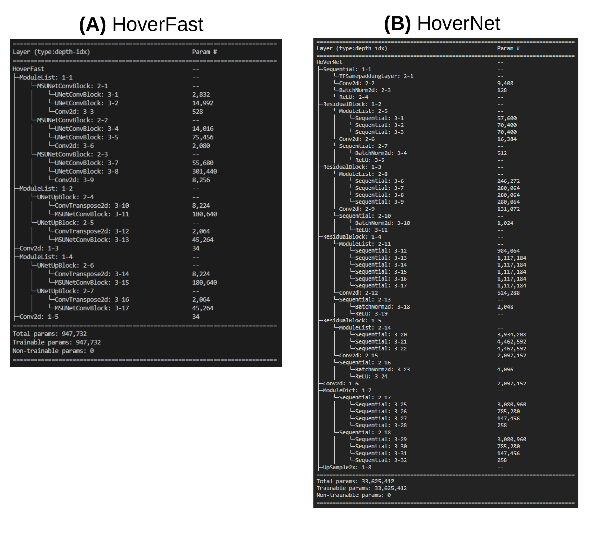

# Summary

In computational digital pathology, accurate nuclear segmentation of Hematoxylin and Eosin (H&E) stained whole slide images (WSIs) is a critical step for many analyses and tissue characterizations. One popular deep learning-based nuclear segmentation approach, HoverNet [@graham2019hover], offers remarkably accurate results but lacks the high-throughput performance needed for clinical deployment in resource-constrained settings. Our approach, HoverFast, aims to provide fast and accurate nuclear segmentation in H&E images using knowledge distillation from HoverNet. By redesigning the tool with software engineering best practices, HoverFast introduces advanced parallel processing capabilities, efficient data handling, and optimized postprocessing. These improvements facilitate scalable high-throughput performance, making HoverFast more suitable for real-time analysis and application in resource-limited environments. Using a consumer grade Nvidia A5000 GPU, HoverFast showed a 21x speed improvement as compared to HoverNet; reducing mean analysis time for 40x WSIs from ~2 hours to 6 minutes while retaining a concordant mean Dice score of 0.91 against the original HoverNet output. Peak memory usage was also reduced 71% from 44.4GB, to 12.8GB, without requiring SSD-based caching. To ease adoption in research and clinical contexts, HoverFast aligns with best-practices in terms of (a) installation, and (b) containerization, while (c) providing outputs compatible with existing popular open-source image viewing tools such as QuPath [@bankhead2017qupath]. HoverFast has been made open-source and is available at [andrewjanowczyk.com/open-source-tools/hoverfast](andrewjanowczyk.com/open-source-tools/hoverfast).

# Statement of need

The increasing popularity of digitized pathology images in both research and clinical practice has spurred the widespread adoption of deep learning (DL) approaches for automating various tasks, with nuclear segmentation standing out as a crucial step in many analyses. This segmentation process involves delineating the contours of cell nuclei within a 2D whole slide image (WSI). Nuclei, rather than complete cells, are targeted due to strong contrast afforded by routinely employed hematoxylin staining. Hematoxylin's selective affinity for nucleic acids results in the distinct visualization of nuclei in purple, facilitating their clear identification amidst less prominently stained cytoplasm and other cellular constituents. 
Given the small size of nuclei, their segmentation typically takes place at 40x magnification (~0.25 microns per pixel (mpp)); the highest magnification supported by most current digital slide scanners. Working at this scale can be time-intensive for algorithms, especially on consumer grade GPUs, as WSIs are especially large, reaching up to 120,000x120,000 pixels.  While several existing tools like StarDist [@schmidt2018] [@weigert2020] and CellPose [@stringer2021cellpose] have been developed to tackle the challenge of nuclear segmentation, HoverNet[@graham2019hover] has emerged as one of the leading solutions in terms of segmentation accuracy, particularly for its application to H&E-stained tissue. 

Despite its accurate results, HoverNet remains resource-intensive and time-consuming due to its high model parameter count and lengthy post-processing steps. HoverNet additionally requires significant SSD storage for caching during runtime, often reaching over 120GB per WSI. These properties make it challenging to deploy in more resource limited settings such as consumer grade workstations or in clinical environments requiring high-throughput processing. Therefore, there is an emerging need for a fast, accurate, and computationally efficient  tool that can make large-scale nuclear segmentation more accessible for both research and clinical applications. 

Motivated by the need for accurate yet efficient nuclear segmentation, we introduce HoverFast. This tool replicates the output of the established HoverNet model while achieving superior computational efficiency. HoverFast achieves this through knowledge distillation, a technique where a smaller “student” model (HoverFast) learns to capture the knowledge from a larger “teacher” model (HoverNet). The goal is to enable the student model to achieve comparable performance to that of the teacher model, while requiring significantly less computational resources for inference [@hinton2015distilling], [@hu2022teacher].

To facilitate the knowledge distillation process, HoverFast presents a training pipeline, using HoverNet output as ground truth (see **Figure 1**), that enables the resulting  model to have 30 times fewer parameters. As implemented, HoverFast provides:

-	A containerized docker script to generate HoverNet ground truth on user-provided data
-	A training pipeline for a custom HoverFast model 
-	Alternatively, a pre-trained cross-organ model for inference
-	An inference pipeline for tiles and WSIs with tissue masks to delineate area of computation
-	Compressed JSON output file directly compatible with QuPath
-	A speedup of 21x over HoverNet, on consumer-grade compute infrastructure

{height="210pt"}

# Implementation

## Inference
HoverFast has a command-line interface (CLI) written in Python 3.11 and utilizes the PyTorch framework [@paszke2017automatic].  We replicated the structure of the HoverNet model as described by Graham et al [@graham2019hover] without the nuclear classification branch. For the backbone, we used a modified 940k parameter Multi-scale UNet [@su2021msu]  in place of HoverNet’s 33.6 million parameter ResNet50, yielding a reduction in model parameter count by a factor of 30 (see **Appendix 1**). 

HoverFast’s post-processing pipeline was heavily optimized using scikit-learn’s [@scikit-learn] regionprops and watershed functions to effectively identify and split merged cells. To improve throughput after batch model inference, regions are processed in parallel using a “multi-worker, single writer” approach. This involves each worker independently (a) post-processing its assigned region, and then (b) generating nuclei polygon coordinates using OpenCV [@opencv_library], before (c) sending to the single writing process for saving as a QuPath [@bankhead2017qupath] compatible gzip-compressed JSON file. A Docker and Singularity container of HoverFast are provided.

## Training

To help users train their own models, we provide a Docker container with HoverNet installed, and a script that (a) accepts a directory of WSIs (or tiles), (b) randomly extracts a user-specified number of tiles, (c) employs HoverNet on these tiles to generate labeled masks of nuclei, and finally (d) saves the original images and associated masks into two PyTables files, one for training and one for validation. HoverFast can then accept these PyTables files as arguments in its training script to yield a use-case specific model. We employ knowledge distillation during HoverFast training using the same loss function as HoverNet. The teacher model, HoverNet, guides the student model, HoverFast, by providing the ground truth binary mask as target. Additionally, HoverFast learns to reproduce the horizontal and vertical distance maps allowing HoverFast to inherit HoverNet's post-processing abilities for separating touching nuclei.

# Experiments

## Experiment 1: Comparison of HoverNet and HoverFast on a cross organ dataset

Employing n=97 WSIs of diverse tissue types, from The Cancer Genome Atlas (TCGA) [@weinstein2013cancer], 15 randomly selected tiles of 1,024x1,024 pixels from each WSI were extracted. A HoverFast model was then trained as described in [Training](#training), for 100 epochs with a batch size of 16. For validation, 74 tiles of 1,024x1,024 pixels from 14 slides of diverse tissue types were used. Inference using both HoverNet and HoverFast was performed on the validation tiles, and the binary masks of predicted cell nuclei were overlapped to obtain a Dice score between the two tools. The resulting Dice score of 0.91 appears concordant with the qualitative results (see **Figure 2**); these show very similar segmentation results, with HoverFast able to segment slightly more faint nuclei than HoverNet.

{height="300pt"}

## Experiment 2: Comparison of HoverNet, cross-tissue HoverFast, and site-specific HoverFast

From n=54 melanoma samples, (a) for training: 20 1,024x1,024 tiles were randomly selected per slide from within available tumor masks, and (b) for validation: 50 tiles of 1,024x1,024 from 8 slides were selected. For evaluation, 3 models were compared: (i) HoverNet, as a baseline, (ii) the HoverFast model trained in [Experiment 1](#experiment-1-comparison-of-hovernet-and-hoverfast-on-a-cross-organ-dataset), and (iii) a melanoma specific model trained following the procedure in [Training](#training). The HoverFast models had Dice scores of 0.88 and 0.91 respectively against HoverNet, with qualitative results indicating a high degree of similarity. There were slight changes on nuclei edges and faint nuclei (see **Figure 3**), with a systematic superiority for the tissue-specific output. Taken together, the increased accuracy in the melanoma specific model demonstrates that investing in training a dataset-specific model appears to provide added value.

## Experiment 3: Benchmarks comparing processing time and memory footprint

To compare computational speed, n=4 slides from TCGA with corresponding tissue masks generated with HistoQC [@janowczyk2019histoqc] were analyzed on a machine with a 16 core Intel(R) Core(TM) i9-12900K CPU, a Nvidia A5000 GPU with 24GB of VRAM, and 128Gb of DDR5 RAM. For both HoverNet and HoverFast, the GPU batch size was set to maximize GPU memory usage. For HoverNet, a batch size of 90 was used, with 20 CPU threads for pre- and post-processing. Similarly, for HoverFast, a batch size of 11 and 20 CPU threads were used.  A mean speed improvement of 20.8x times (see **Table 1**) was demonstrated. The maximum RAM consumption was reduced by 71% with 44.4 GB for HoverNet versus 12.8 GB for HoverFast. Additionally, HoverNet required a peak of 118 GB of SSD space for its cache during run-time, while HoverFast did not appear to require any.

| *Slide ID* | *HoverNet*       | *HoverFast*  | *Speedup* |
|------------|------------------|--------------|-----------|
| Slide 1    | 58mins 5s        | 3mins 1s     | 19.2x     |
| Slide 2    | 1hr 11mins 38s   | 3mins 33s    | 20.2x     |
| Slide 3    | 2hrs 55mins 24s  | 8mins 4s     | 21.7x     |
| Slide 4    | 3hrs 4mins 25s   | 8mins 50s    | 20.9x     |
| **Total**  | **8hrs 9mins 32s** | **23mins 28s** | **20.8x** |

: Detailed table of computation time per slide for each tool with associated speedup []{label=”proglangs”}

# Discussion and Conclusions:

HoverFast represents a practical solution to the challenge of nuclear segmentation in WSIs, emphasizing speed, resource efficiency and local trainability. It distinguishes itself by providing a significant speedup in processing time with a 21x improvement over HoverNet on consumer grade hardware in addition to a more than 3x reduction in RAM footprint while also eliminating hard-drive based caching. This efficiency is crucial for users with limited resources, enabling faster analysis while retaining segmentation results highly comparable to  those of HoverNet.
While a pre-trained cross-tissue model is provided with the software, if higher accuracy and greater similarity to HoverNet is required, a cohort specific model should be trained. Additionally, although HoverFast does have a built-in feature for tissue detection, we highly recommend the use of quality control tools, such as HistoQC to obtain more robust tissue masks, thus avoiding computation on artefactual regions and further reducing computation time.
HoverFast is easy to install and provides simple drag and drop output compatibility with QuPath. It is publicly available for use and modification at [andrewjanowczyk.com/open-source-tools/hoverfast](andrewjanowczyk.com/open-source-tools/hoverfast).

## Appendix 1

{height="400pt"}

The appendix presents a comparison between HoverFast and HoverNet architectures. This information was produced using the Python Torchinfo Summary package. The first column outlines the model architecture, while the second delves into the number of parameters for each layer. It is noteworthy that HoverFast substantially smaller number of parameters (roughly 30 times fewer than HoverNet) which, along with the optimized post-processing and file handling, translates to lower memory footprint and faster processing time. This enables HoverFast to handle larger batches of data and allowing parallel post-processing computation, ultimately leading to a well-suited tool for resource limited environments.

# References
